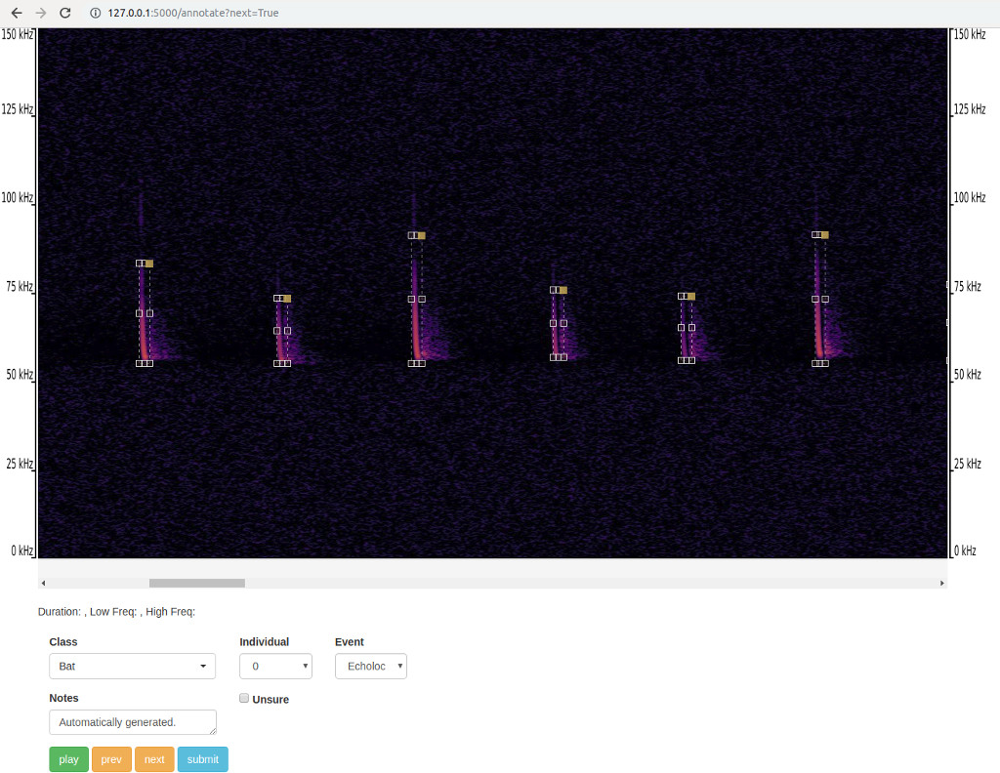

# BatDetect2: Audio Annotation Interface

This GUI allows you to view and edit the predictions from the [BatDetect2](https://github.com/macaodha/batdetect2) bat call classification model. You can also make your own annotations for training your own models. The GUI is web based and will run in your web browser locally - see the video linked below for an overview.  


### Getting Started: Installation
1) Install the Anaconda Python 3.10 distribution for your operating system from [here](https://www.continuum.io/downloads).  
2) Download this code from the repository (by clicking on the green button on top right) and unzipping it.  
3) Create a new environment and install the required packages:  
`conda create -y --name batdetect2_gui python==3.10`  
`conda activate batdetect2_gui`  
`conda install --file requirements.txt`  


### Getting Started: Running Locally  
To run the interface, open up the command line, change to the directory of where the application is stored and type:  
`python application.py`

This will launch the application and it will point you to a URL that you can paste into your web browser e.g. `http://127.0.0.1:8000`.  
You will be prompted to point to an directory of audio files and a directory of where to store the generated annotations. If you already have some `.json` annotation files e.g. from running the automatic detection and classification code you can point to those files here too.    

Example audio files can be found in `example_data/audio/` and their corresponding annotations are available in `example_data/anns/`. Type these two paths into the GUI to explore the data.    

There are keyboard shortcuts listed on the annotation page inside the GUI e.g. `space` plays the audio file, and clicking on the audio bar will skip backwards or forwards. To add more species names you can edit the list `CLASS_NAMES` in `config.py`, but you can also type new species names in the GUI directly.       

To quit, type `Ctrl+C` into the command line console that is running the annotation application.  


### Data Preparation 
The GUI will be slow if the input files are long e.g. > 5 seconds. It will also take a lot of time to annotation each file if it is too long.         

You can clip your files so that they are shorter using the `prepare_audio_files.py` script. You need to specify the locations of the input files and where you want the shorter files to be saved. There are additional settings that allow you to specify the output duration and where in the file you start clipping from.      
`python prepare_audio_files.py path_to_input_directory/ path_to_output_directory` e.g.  
`python prepare_audio_files.py example_data/audio/ example_data/audio_clipped/`

Alternatively, you can use [sox](http://sox.sourceforge.net) to split the files e.g. for 2 second chunks `sox infile.wav output.wav trim 0 2 : newfile : restart`.  

The GUI currently only works with `.wav` files and does not support stereo recordings. 
 

### Annotation Instructions  
For each audio clip try to annotate **all** the bat calls present, even the faint ones.  
If you don't know the species, you can set it to `Bat`.  
Use the individual ID field to associate multiple calls to the same bat.  
You need to click `submit` on the annotation page to save the current annotation.  


### Video Tutorial  
Click on the image below to view a short tutorial that describes how to use the system. Note, the video shows a slightly older version of the interface, but most of the steps are still relevant.    
[](https://youtu.be/Mlb7OiYAaNA)


### Data Format
You can read more about the json data format [here](data_format.md).  


### Advanced: Running the GUI on a Remote Server  
You can find instructions [here](remote_instructions.md) for how to run the GUI on a web server that can then be made accessible to others over the internet. 


### Reference
If you find our work useful in your research please consider citing our paper:
```
@article{batdetect2_2022,
    title     = {Towards a General Approach for Bat Echolocation Detection and Classification},
    author    = {Mac Aodha, Oisin and  Mart\'{i}nez Balvanera, Santiago and  Damstra, Elise and  Cooke, Martyn and  Eichinski, Philip and  Browning, Ella and  Barataudm, Michel and  Boughey, Katherine and  Coles, Roger and  Giacomini, Giada and MacSwiney G., M. Cristina and  K. Obrist, Martin and Parsons, Stuart and  Sattler, Thomas and  Jones, Kate E.},
    journal   = {bioRxiv},
    year      = {2022}
}
```
